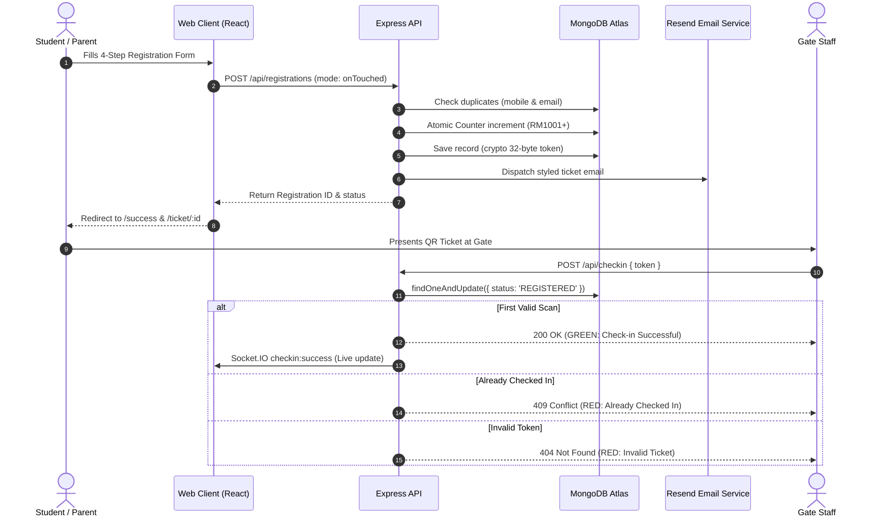

# Yasir Ali Classes — Rankers Meet 2026
## Complete Step-by-Step Working & Operational Guide

This document provides an exhaustive, step-by-step operational walkthrough of the **Rankers Meet 2026** platform. It details both the **user journey** (students, parents) and the **operational workflow** (event coordinators, gate scanning staff, super admins).

---

## Table of Contents

1. [Architecture & Lifecycle Overview](#1-architecture--lifecycle-overview)
2. [Step-by-Step Working Guide](#2-step-by-step-working-guide)
   - [Step 1: Public Event Discovery & Landing Page](#step-1-public-event-discovery--landing-page)
   - [Step 2: Multi-Step Student Registration](#step-2-multi-step-student-registration)
   - [Step 3: Sequential ID Generation & Database Ingestion](#step-3-sequential-id-generation--database-ingestion)
   - [Step 4: Automated Email Notification Dispatch](#step-4-automated-email-notification-dispatch)
   - [Step 5: Digital QR Ticket Retrieval & Download](#step-5-digital-qr-ticket-retrieval--download)
   - [Step 6: Staff & Admin Authentication](#step-6-staff--admin-authentication)
   - [Step 7: Live Real-Time Dashboard & Analytics](#step-7-live-real-time-dashboard--analytics)
   - [Step 8: Gate Entrance QR Scanning & Audio Feedback](#step-8-gate-entrance-qr-scanning--audio-feedback)
   - [Step 9: Race Condition & Duplicate Pass Prevention](#step-9-race-condition--duplicate-pass-prevention)
   - [Step 10: Manual Search Fallback](#step-10-manual-search-fallback)
   - [Step 11: Attendee Directory, Audit Trail & Details Modal](#step-11-attendee-directory-audit-trail--details-modal)
   - [Step 12: Reporting, CSV & Excel (.xlsx) Exports](#step-12-reporting-csv--excel-xlsx-exports)
   - [Step 13: Event Settings & RBAC Privilege Guards](#step-13-event-settings--rbac-privilege-guards)
3. [System Data Flow Diagrams](#3-system-data-flow-diagrams)
4. [Event Day Standard Operating Procedure (SOP)](#4-event-day-standard-operating-procedure-sop)
   - [T-Minus 24 Hours (Preparation Checklist)](#t-minus-24-hours-preparation-checklist)
   - [Event Morning (Entrance Gate Setup)](#event-morning-entrance-gate-setup)
   - [During the Event (Gate Operations)](#during-the-event-gate-operations)
   - [Post-Event (Wrap-Up & Exports)](#post-event-wrap-up--exports)

---

## 1. Architecture & Lifecycle Overview

The platform operates across 3 integrated tiers:
1. **Public Experience Tier**: Landing Page (`/rankers-meet`), Multi-Step Registration (`/rankers-meet/register`), Registration Success (`/rankers-meet/success/:id`), and Digital Ticket (`/rankers-meet/ticket/:id`).
2. **Real-Time Entrance Verification Tier**: Mobile/Camera QR Scanner (`/admin/check-in`) powered by `html5-qrcode`, Web Audio procedural sound synthesizer, and atomic MongoDB concurrency locks.
3. **Operations & Executive Tier**: Real-time KPI Dashboard (`/admin`) powered by Socket.IO, Attendee Directory with 11 columns and modals (`/admin/registrations`), and CSV/Excel export engines (`/api/export`).

---

## 2. Step-by-Step Working Guide

```
+------------------+      +-------------------+      +--------------------+      +--------------------+
|  1. Landing Page | ---> | 2. Register Form  | ---> |  3. Success Pass   | ---> | 4. Ticket Page     |
|   /rankers-meet  |      |  /register (Zod)  |      |   /success/:id     |      |  /ticket/:id (QR)  |
+------------------+      +-------------------+      +--------------------+      +--------------------+
                                    |                                                      |
                                    v                                                      v
                          +-------------------+                                  +--------------------+
                          | Resend Email API  |                                  | Gate Scanner       |
                          | Auto-Confirmation |                                  | /admin/check-in    |
                          +-------------------+                                  +--------------------+
                                                                                           |
                                      +----------------------------------------------------+
                                      v
                          +-------------------------+      +--------------------------+
                          | Live Admin Dashboard    | <--- | Socket.IO Broadcast      |
                          | /admin (Recharts KPIs)  |      | Real-time Check-in sync  |
                          +-------------------------+      +--------------------------+
```

---

### Step 1: Public Event Discovery & Landing Page
- **URL**: `http://localhost:5173/rankers-meet` (or `https://yasiraliclasses.in/rankers-meet`)
- **Action**: Students or parents visit the landing page to learn about Rankers Meet 2026.
- **Key Sections**:
  1. **Branded Navbar**: Official Yasir Ali Classes emblem, quick links, and "Register for Felicitation" CTA.
  2. **Hero Banner**: Highlights event date (*Sunday, May 24, 2026*), venue (*Auditorium, Aligarh Cultural Complex*), and direct registration actions.
  3. **Event Counters**: Dynamic badges highlighting 500+ Rankers expected, 100% custom trophies, 20+ faculty mentors, and 1,200 venue seating capacity.
  4. **About Felicitation**: Highlights Yasir Ali Classes' 12+ year legacy in coaching NEET, JEE, CUET, and Commerce rank-holders.
  5. **Who Can Attend**: Target candidate cohorts (NEET 600+, JEE 90%ile+, AMU Entrance toppers, 12th/10th Board 90%+).
  6. **Program Schedule**: Detailed morning timeline from 10:00 AM Registration to 02:00 PM Royal Banquet.
  7. **Interactive Previous Event Gallery**: Filterable photo gallery (*All Highlights*, *Trophy Presentations*, *Family Honors*, *Mentorship*, *Banquet*) showcasing past felicitation ceremonies.
  8. **Venue Card with Google Maps**: Address details, parking guidance, and one-click Google Maps navigation.
  9. **FAQ Accordion**: Answers to common queries (dress code, guest admission, ticket downloading).

---

### Step 2: Multi-Step Student Registration
- **URL**: `http://localhost:5173/rankers-meet/register`
- **Action**: Student enters information across 4 logical steps:
  - **Step 1 — Personal Details**:
    - Student Full Name
    - Parent / Guardian Name
    - Mobile (WhatsApp Number) — *Validated strictly against 10-digit Indian pattern `/^[6-9]\d{9}$/`*
    - Email Address — *Validated against email RFC pattern*
  - **Step 2 — Academic Details**:
    - Class/Course (*Class 12*, *Class 11*, *Repeater / Dropper*, *Foundation 9-10*, *Crash Course*)
    - Competitive Exam (*NEET*, *JEE Main*, *JEE Advanced*, *Commerce / CUET*, *Boards / Olympiad*, *AMU Entrance*)
    - Rank / Percentile (*e.g. AIR 412, 99.4%ile*)
    - School / College Name (*e.g. DPS Aligarh, Our Lady of Fatima*)
  - **Step 3 — Accompanying Guests**:
    - Number of Guests joining the banquet (*0, 1, 2, 3, 4+*)
    - Special seating or accessibility assistance notes
  - **Step 4 — Confirmation & Review**:
    - Summary card consolidating all candidate entries for final verification.
- **Validation UX**: Form operates in `mode: 'onTouched'` — inputs validate immediately as students type or tab away, showing clear red error helper messages.
- **Submission Protection**: Clicking `"Complete Registration"` immediately disables the button, replaces the label with `"Processing Registration..."` and an animated spinner, preventing accidental double-submissions.

---

### Step 3: Sequential ID Generation & Database Ingestion
- **Endpoint**: `POST /api/registrations`
- **Action**:
  1. Backend receives payload and validates via Zod schema.
  2. Evaluates duplicate rules: checks if the mobile or email is already registered.
  3. Increments MongoDB atomic sequential counter (`counters` collection) to generate the next canonical ID (e.g. `RM1001`, `RM1002`, `RM1003`).
  4. Generates a secure, 32-byte cryptographic hex token (`qrToken`) using Node.js `crypto.randomBytes(32).toString('hex')`.
  5. Saves the registration document with `status: 'REGISTERED'` and `checkedIn: false`.
  6. Emits `registration:new` via Socket.IO to immediately notify connected admin dashboards.
  7. Returns `{ success: true, data: { registrationId: "RM1001", studentName, status } }`.

---

### Step 4: Automated Email Notification Dispatch
- **Service**: Resend API integration (`server/src/services/emailService.js`)
- **Action**:
  1. Triggered asynchronously upon successful database save (non-blocking so the student UI never hangs).
  2. Constructs an HTML ticket email:
     - Header with Yasir Ali Classes branding.
     - Student name, registration ID (`RM1001`), exam, and rank.
     - Date, time, venue address, and parking instructions.
     - Direct button to view and print the digital ticket pass (`${CLIENT_URL}/rankers-meet/ticket/:id`).
  3. Dispatches email via Resend SDK with subject `"Rankers Meet 2026 — Registration Confirmed"`.
  4. Updates registration record `emailStatus`: marked as `'SENT'` upon success or `'FAILED'` upon delivery error.
  5. *Safe Fallback*: If `RESEND_API_KEY` is not provided, the server logs a formatted mock email to the console without throwing exceptions.

---

### Step 5: Digital QR Ticket Retrieval & Download
- **URL**: `http://localhost:5173/rankers-meet/ticket/:id`
- **Action**:
  1. The page queries `GET /api/tickets/:id`.
  2. The server generates a 300 DPI high-contrast Base64 QR code data URL representing the student's 32-byte token.
  3. **Privacy Shield**: The raw cryptographic token is *never* exposed in the public JSON response; only the scannable image data URL is returned.
  4. The frontend renders the printable event pass:
     - Gold and Navy card header.
     - Student Name, Registration ID, Exam, and Rank.
     - Center QR pass with scan instructions.
     - Accompanying guest count badge.
     - Live status badge: `STATUS: REGISTERED` (or `STATUS: CHECKED IN` with timestamp).
  5. **Actions**:
     - `"Download Ticket"`: Downloads the ticket as an image/PDF.
     - `"Print Pass"`: Triggers browser print dialog with print-specific CSS.
     - `"Venue Location"`: Opens Google Maps directly to the Aligarh Cultural Complex.

---

### Step 6: Staff & Admin Authentication
- **URL**: `http://localhost:5173/admin/login`
- **Action**:
  1. User enters official email and password.
  2. Backend looks up user in `admins` collection and compares bcrypt password hash.
  3. **Security**: Returns a generic `"Invalid email or password."` error for any mismatch (preventing account enumeration attacks).
  4. Upon success, generates a 7-day signed JWT containing `{ id, role }`.
  5. Frontend stores JWT in local storage and attaches it to all subsequent requests via Axios request interceptor (`Authorization: Bearer <token>`).
  6. Directs user to `/admin` dashboard.

---

### Step 7: Live Real-Time Dashboard & Analytics
- **URL**: `http://localhost:5173/admin`
- **Components**:
  1. **4 KPI Statistics Cards**:
     - **Total Registered**: Current count of registered candidates.
     - **Checked In**: Total verified gate entries.
     - **Pending Arrival**: Calculated expected students (`Total Registered - Checked In`).
     - **Guest Count**: Total accompanying family members.
  2. **Gate Check-in Progress Bar**: Live percentage completion bar (e.g. `69.8% Check-in Completion Rate`).
  3. **3 Interactive Recharts Visualizations**:
     - **Registrations Over Time**: `AreaChart` with subtle gradient fill showing daily registration trajectory.
     - **Registrations by Exam**: Vertical `BarChart` comparing NEET, JEE, CUET, and Boards.
     - **Registrations by Class**: Donut `PieChart` breaking down cohort percentages (`Class 12`, `Repeater`, `Foundation`).
  4. **Live Recent Check-ins Ticker**: Displays the latest 10 gate scans in real time (Student Name, ID, `Checked In` badge, and timestamp).
  5. **Socket.IO Auto-Sync**: Listens for `checkin:success` and `registration:new` events; widgets, charts, and counters update immediately without manual page refresh.

---

### Step 8: Gate Entrance QR Scanning & Audio Feedback
- **URL**: `http://localhost:5173/admin/check-in`
- **Hardware**: Staff uses any smartphone, tablet, or laptop camera.
- **Scanner Flow**:
  1. Staff opens `/admin/check-in`. The page initializes `html5-qrcode` accessing the rear camera (`facingMode: 'environment'`).
  2. Staff points camera at the student's printed or on-screen QR code.
  3. Scanner decodes the 32-byte cryptographic token and pauses the camera to prevent double-reads.
  4. Frontend dispatches `POST /api/checkin` with `{ token: "secure-token" }` and staff authorization header.
  5. **Procedural Web Audio Sound**:
     - **Valid Pass**: Synthesizes a high melodic dual-tone chime (587 Hz -> 880 Hz).
     - **Duplicate Pass**: Synthesizes a distinctive pulsing warning alert (440 Hz -> 330 Hz).
     - **Invalid Pass**: Synthesizes a low error buzz (180 Hz).
  6. **Display State**:
     - **🟢 Emerald Green Card**: `VERIFIED ENTRANCE — VALID — CHECK-IN SUCCESSFUL` displaying student name, registration ID, exam, rank, guest count, and entrance time.
  7. Staff verifies the student's admitted guest count, clicks `"Scan Next Attendee"`, and the camera resumes immediately.

---

### Step 9: Race Condition & Duplicate Pass Prevention
- **Scenario**: Two staff members on separate devices scan the same ticket at the exact same millisecond, or an attendee shares a screenshot of their QR code with a friend.
- **Backend Concurrency Guard**:
  ```javascript
  const updatedRegistration = await Registration.findOneAndUpdate(
    { _id: registration._id, status: 'REGISTERED' },
    {
      $set: {
        status: 'CHECKED_IN',
        checkedIn: true,
        checkedInAt: new Date(),
        checkedInBy: scannedBy,
      },
    },
    { new: true }
  );
  ```
- **Execution Outcome**:
  - The first atomic database write succeeds and marks the attendee checked in (`200 OK`).
  - The second request finds `status` is already `'CHECKED_IN'`; `findOneAndUpdate` returns `null`.
  - Backend logs a `DUPLICATE` entry in the `checkins` audit collection.
  - Backend returns `409 Conflict` with:
    `{ success: false, status: 'DUPLICATE', message: 'ALREADY CHECKED IN', details: 'Aarav Sharma was already checked in at 10:42 AM.' }`.
  - Frontend displays the **🔴 Red Alert Card**: `GATE ACCESS ALERT — ALREADY CHECKED IN` with the original check-in timestamp.

---

### Step 10: Manual Search Fallback
- **Scenario**: A student's phone battery is depleted, or their screen is cracked and unreadable by the camera.
- **Action**:
  1. Staff scrolls down to the **Manual Check-in Search** form below the scanner.
  2. Staff types either the candidate's **Registration ID** (`RM1001`) or **10-Digit Mobile Number** (`9876543210`).
  3. Staff clicks `"Verify Attendee"`.
  4. Backend automatically detects whether the input is an ID or phone number, resolves the candidate, checks them in atomically, logs the staff member's name, and displays the Green verification card.

---

### Step 11: Attendee Directory, Audit Trail & Details Modal
- **URL**: `http://localhost:5173/admin/registrations`
- **Capabilities**:
  1. **11 Canonical Table Columns**:
     `Registration ID` | `Student` | `Mobile` | `Email` | `Class` | `Exam` | `Rank` | `Guests` | `Status` | `Registered At` | `Actions`
  2. **Multi-Factor Live Filters**:
     - Instant search by Name, ID, Mobile, or Email.
     - Filter by Check-in status (`All`, `Pending Check-in`, `Checked In`).
     - Filter by Exam (`NEET`, `JEE Main`, `JEE Advanced`, `Commerce / CUET`, `Boards`).
     - Filter by Class (`Class 12`, `Class 11`, `Repeater`, `Foundation`).
     - Filter by Email delivery status (`Sent`, `Failed`, `Pending`).
  3. **Registration Details Modal**:
     - Clicking any student row opens a detailed profile modal.
     - Displays full parent name, school, ranking, guest count, and contact information.
     - Shows current check-in state and exact entrance timestamp.
     - Fetches and displays the high-resolution scannable QR ticket directly inside the modal for manual verification.
  4. **Action Controls**:
     - Dedicated **Resend Email** button to re-dispatch ticket emails in one click.
     - Manual check-in and undo check-in toggle buttons.

---

### Step 12: Reporting, CSV & Excel (.xlsx) Exports
- **Features**:
  1. **Export CSV (`GET /api/export/registrations`)**:
     - Produces an RFC-compliant CSV containing all 14 mandatory fields:
       `Registration ID`, `Student Name`, `Parent Name`, `Mobile`, `Email`, `Class/Course`, `Exam`, `Rank`, `School/College`, `Guest Count`, `Status`, `Checked In`, `Checked In At`, `Created At`.
  2. **Export Excel (.xlsx) (`GET /api/export/registrations?format=xlsx`)**:
     - Generates a native binary Microsoft Excel spreadsheet with styled columns using SheetJS (`xlsx`).
  3. **Dynamic Filter Respect**:
     - If the admin filters by `Exam: NEET` and clicks "Export Excel", only NEET candidates are exported.
  4. **Check-in History Audit Export (`GET /api/export/checkin-history`)**:
     - Exports entrance audit logs (`Registration ID`, `Student`, `Check-in time`, `Staff`, `Device`, `Status`).
  5. **Attendance Report Summary (`GET /api/export/attendance-report`)**:
     - Executive metrics API delivering total registered, checked in, pending, guests, and percentage.

---

### Step 13: Event Settings & RBAC Privilege Guards
- **URL**: `http://localhost:5173/admin/settings`
- **Role-Based Access Control (RBAC)**:
  - **Super Admin (`role: 'ADMIN'`)**: Can modify event name, date, time, venue location, capacity, registration cutoffs, and contact details.
  - **Gate Staff (`role: 'STAFF'`)**: Opening `/admin/settings` displays an amber privilege warning banner (`"Administrator Access Required"`), all input fields and save buttons are disabled, and backend updates are rejected with `403 Forbidden`.

---

## 3. System Data Flow Diagrams

### Registration & Verification Pipeline



---

## 4. Event Day Standard Operating Procedure (SOP)

### T-Minus 24 Hours (Preparation Checklist)
- [ ] **Run Pre-Event Simulation**: Execute `node server/final_event_simulation.js` to ensure database, exports, and check-in pipelines pass 100%.
- [ ] **Check MongoDB Atlas Health**: Ensure cluster connections and network IP whitelist (`0.0.0.0/0`) are active.
- [ ] **Staff Accounts Verification**: Confirm all gate coordinators have their login credentials:
  - Super Admin: `admin@yasiraliclasses.in`
  - Gate Staff: `staff@yasiraliclasses.in`
- [ ] **Verify Audio on Scanner Devices**: Open `/admin/check-in` on staff phones and ensure media volume is turned up to hear audio feedback chimes.

### Event Morning (Entrance Gate Setup)
- [ ] **Gate Device Placement**: Set up 2 to 4 mobile devices or tablets at entrance gates.
- [ ] **Camera Permissions**: Open `https://yasiraliclasses.in/admin/check-in` on each device and tap `"Allow"` when prompted for camera access.
- [ ] **Test Scan**: Perform a test scan using a dummy registration pass to verify sound and green verification display.
- [ ] **Executive Dashboard Setup**: Project the live dashboard (`https://yasiraliclasses.in/admin`) on coordinator laptops or backstage screens to monitor footfall in real time.

### During the Event (Gate Operations)
1. **Standard Scan**:
   - Point the device camera at the candidate's phone screen or printed ticket.
   - Wait for the **High Melodic Chime** and **Emerald Green Card**.
   - Check the **Admitted Guests** count on screen and issue that number of guest banquet wristbands.
   - Tap `"Scan Next Attendee"` to resume scanning.
2. **Handling Already Checked-In Passes**:
   - If the **Warning Alert** sounds and the **Red Card** appears, check the timestamp on screen.
   - If the candidate claims they stepped outside briefly, verify their photo ID and admit them.
   - If someone else used the pass earlier, escort the individual to the Helpdesk.
3. **Handling Dead Batteries / Lost Tickets**:
   - Use the **Manual Check-in Search** form below the scanner.
   - Type the candidate's 10-digit mobile number or registration ID (`RM...`).
   - Tap `"Verify Attendee"`.

### Post-Event (Wrap-Up & Exports)
1. **Attendance Reconciliation**: Navigate to `/admin/registrations`.
2. **Download Final Reports**:
   - Click `"Export Excel (.xlsx)"` to generate the official master attendee workbook.
   - Click `"Check-in History"` to download the entrance gate scan audit trail.
   - Review executive KPIs on `/admin` for final attendance percentages and guest footfall.

---

### Technical Contacts
- **Institution**: Yasir Ali Classes, Aligarh
- **Official Website**: [yasiraliclasses.in](https://yasiraliclasses.in)
- **Technical Support**: `support@yasiraliclasses.in`
